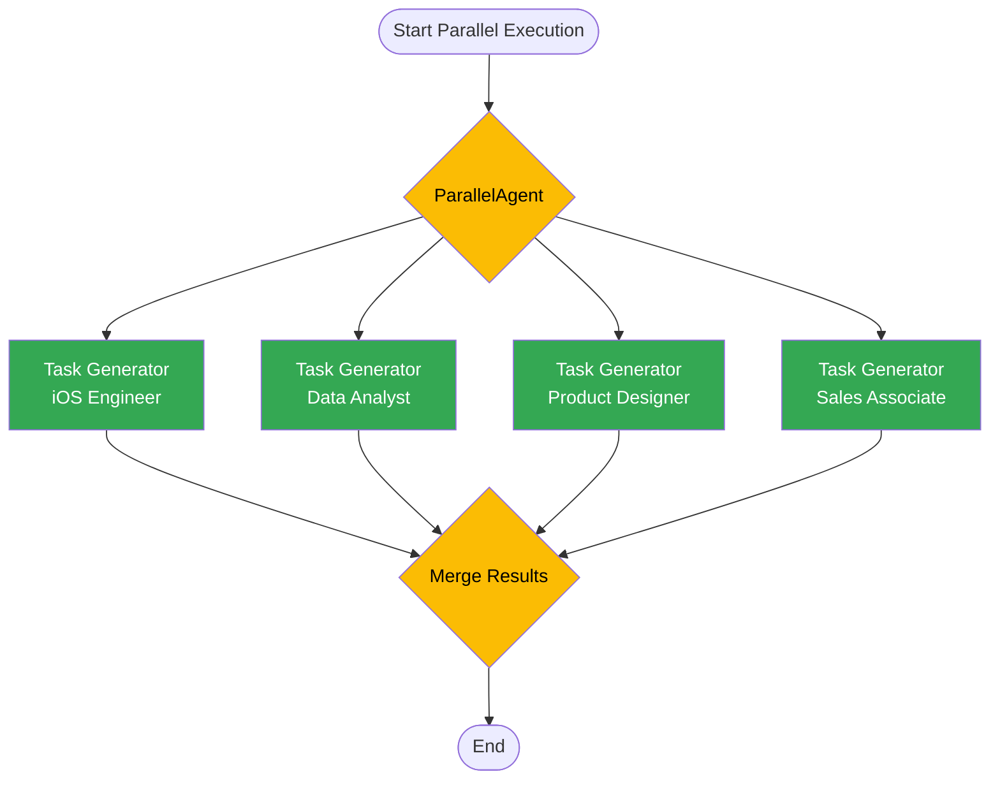
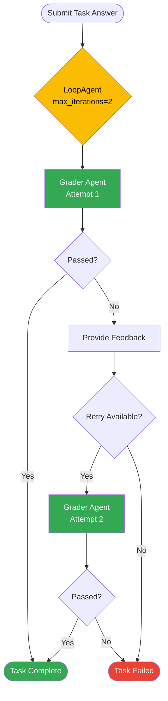
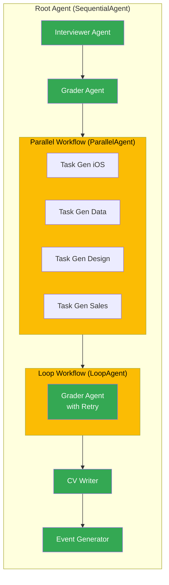

# ADK Patterns Demonstration

This document illustrates the three main ADK patterns used in this project.

## 1. Sequential Pattern

The Root Agent uses SequentialAgent to run sub-agents in order.

```mermaid
flowchart LR
    START([Start]) --> INT[Interviewer Agent]
    INT --> GRAD1[Grader Agent]
    GRAD1 --> TASK[Task Generator]
    TASK --> GRAD2[Grader Agent]
    GRAD2 --> CV[CV Writer]
    CV --> EVENT[Event Generator]
    EVENT --> END([End])
    
    style INT fill:#34a853,color:#fff
    style GRAD1 fill:#34a853,color:#fff
    style TASK fill:#34a853,color:#fff
    style GRAD2 fill:#34a853,color:#fff
    style CV fill:#34a853,color:#fff
    style EVENT fill:#34a853,color:#fff
```



**Code Example** (`agents/root_agent.py`):
```python
from google.adk.agents import SequentialAgent

root_agent = SequentialAgent(
    name="CareerRoguelikeRootAgent",
    sub_agents=[
        interviewer_agent,
        grader_agent,
        task_generator_agent,
        grader_agent,  # Reused for task grading
        cv_writer_agent,
        event_generator_agent
    ],
    description="Orchestrates the career simulation workflow"
)
```

**Benefits**:
- Clear execution order
- State flows naturally from one agent to the next
- Easy to debug and understand
- Each agent builds on previous results

---

## 2. Parallel Pattern

ParallelAgent runs multiple agents concurrently for faster execution.



**Code Example** (`agents/workflows.py`):
```python
from google.adk.agents import ParallelAgent

# Create specialized task generators for each profession
task_generator_ios = LlmAgent(
    name="TaskGeneratorIOS",
    model="gemini-2.5-flash",
    instruction="Generate iOS engineering task...",
    output_key="task_ios"
)

task_generator_data = LlmAgent(
    name="TaskGeneratorData",
    model="gemini-2.5-flash",
    instruction="Generate data analysis task...",
    output_key="task_data"
)

# ... similar for design and sales

parallel_task_workflow = ParallelAgent(
    name="ParallelTaskGenerator",
    sub_agents=[
        task_generator_ios,
        task_generator_data,
        task_generator_design,
        task_generator_sales
    ],
    description="Generates tasks for all professions simultaneously"
)
```

**Benefits**:
- Faster execution (4 tasks generated in parallel vs sequential)
- Efficient use of resources
- Demonstrates ADK's concurrency capabilities
- Ideal for independent operations

**Performance Comparison**:
- Sequential: ~8 seconds (4 agents × 2 seconds each)
- Parallel: ~2 seconds (all agents run simultaneously)

---

## 3. Loop Pattern

LoopAgent wraps an agent to run it multiple times with retry logic.



**Code Example** (`agents/workflows.py`):
```python
from google.adk.agents import LoopAgent

# Wrap the grader agent in a loop for retry logic
loop_grader = LoopAgent(
    agent=grader_agent,
    max_iterations=2,
    description="Grades task with one retry opportunity"
)

# Use in task workflow
task_workflow = SequentialAgent(
    name="TaskWorkflow",
    sub_agents=[
        task_generator_agent,
        loop_grader,  # Will retry once if failed
        cv_writer_agent
    ]
)
```

**Benefits**:
- Automatic retry logic
- Gives players a second chance
- Provides feedback for improvement
- Demonstrates ADK's loop capabilities

**Flow Example**:
1. Player submits task answer
2. Grader evaluates (Attempt 1)
3. If score < 70: Provide feedback, allow retry
4. Player submits improved answer
5. Grader evaluates (Attempt 2)
6. If score >= 70: Pass and update CV
7. If score < 70: Fail (max iterations reached)

---

## Combined Pattern Example

The complete workflow combines all three patterns:



This demonstrates **excellent multi-agent collaboration** by:
1. **Sequential coordination** through the Root Agent
2. **Parallel execution** for independent task generation
3. **Loop logic** for retry mechanisms
4. **State sharing** through session.state dictionary
5. **Event-driven communication** via ADK's yield system

---

## Pattern Selection Guide

| Pattern | Use When | Example |
|---------|----------|---------|
| **Sequential** | Agents depend on each other's outputs | Interview → Grade → Task → CV |
| **Parallel** | Agents are independent | Generate tasks for all professions |
| **Loop** | Need retry or iteration logic | Grade with retry opportunity |

## State Management Across Patterns

All patterns share state through the `session.state` dictionary:

```python
# Sequential: Each agent reads previous agent's output
state = {
    "profession": "ios_engineer",           # Set by Gateway
    "interview_questions": [...],           # Set by Interviewer
    "grading_result": {...},                # Set by Grader
    "current_task": {...},                  # Set by Task Generator
    "cv_data": {...}                        # Set by CV Writer
}

# Parallel: Each agent writes to unique key
state = {
    "task_ios": {...},                      # Set by iOS Task Gen
    "task_data": {...},                     # Set by Data Task Gen
    "task_design": {...},                   # Set by Design Task Gen
    "task_sales": {...}                     # Set by Sales Task Gen
}

# Loop: Agent updates same key on each iteration
state = {
    "task_result": {
        "score": 65,
        "passed": false,
        "attempt": 1                        # First attempt
    }
}
# After retry:
state = {
    "task_result": {
        "score": 78,
        "passed": true,
        "attempt": 2                        # Second attempt
    }
}
```
