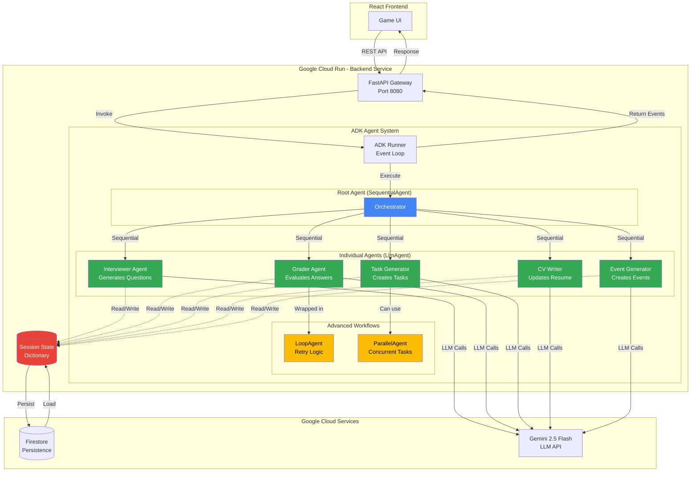

# Agent Workflow Diagram

This diagram shows how agents communicate through ADK patterns (Sequential, Parallel, Loop).

## Pattern Explanations

### SequentialAgent (Root Agent)
The Root Agent orchestrates all sub-agents in sequence. Each agent completes before the next begins, with state passed through the session.state dictionary.

### LlmAgent (Individual Agents)
Each specialized agent uses Gemini 2.5 Flash to perform its specific task:
- **Interviewer**: Reads profession/level → Generates questions
- **Grader**: Reads questions/answers → Returns score/feedback
- **Task Generator**: Reads profession/level → Creates work task
- **CV Writer**: Reads completed tasks → Generates resume bullets
- **Event Generator**: Reads profession/performance → Creates career event

### LoopAgent (Retry Logic)
Wraps the Grader Agent to allow task retries. If a player fails a task, they get one more attempt with feedback.

### ParallelAgent (Concurrent Execution)
Demonstrates running multiple task generators simultaneously for all four professions, showcasing ADK's parallel execution capabilities.
