# State Flow Diagram

This diagram shows how session.state is updated throughout the game flow.

```mermaid
sequenceDiagram
    participant UI as Frontend
    participant GW as Gateway API
    participant RUN as ADK Runner
    participant ROOT as Root Agent
    participant INT as Interviewer
    participant GRAD as Grader
    participant TASK as Task Gen
    participant CV as CV Writer
    participant EVENT as Event Gen
    participant FS as Firestore
    
    Note over UI,FS: Session Creation
    UI->>GW: POST /sessions<br/>{profession, level}
    GW->>FS: Create session doc
    Note over FS: state = {<br/>  profession: "ios_engineer",<br/>  level: 3,<br/>  status: "new"<br/>}
    GW-->>UI: {session_id}
    
    Note over UI,FS: Interview Phase
    UI->>GW: POST /invoke<br/>{action: "interview"}
    GW->>FS: Load session
    GW->>RUN: runner.run(root_agent)
    RUN->>ROOT: Execute
    ROOT->>INT: Run interviewer_agent
    Note over INT: Reads state.profession<br/>Reads state.level
    INT->>INT: Call Gemini API
    INT->>ROOT: Yield event
    Note over ROOT: state.interview_questions = [<br/>  {question: "...", expected: "..."},<br/>  {question: "...", expected: "..."},<br/>  {question: "...", expected: "..."}<br/>]
    ROOT->>FS: Persist state
    ROOT-->>GW: Events
    GW-->>UI: {interview_questions}
    
    Note over UI,FS: Answer Submission
    UI->>GW: POST /invoke<br/>{action: "submit_answer",<br/>data: {answer: "..."}}
    GW->>FS: Load session
    GW->>RUN: runner.run(root_agent)
    RUN->>ROOT: Execute
    ROOT->>GRAD: Run grader_agent
    Note over GRAD: Reads state.interview_questions<br/>Reads request.data.answer
    GRAD->>GRAD: Call Gemini API
    GRAD->>ROOT: Yield event
    Note over ROOT: state.grading_result = {<br/>  score: 85,<br/>  passed: true,<br/>  feedback: "..."<br/>}<br/>state.status = "hired"
    ROOT->>FS: Persist state
    ROOT-->>GW: Events
    GW-->>UI: {grading_result}
    
    Note over UI,FS: Task Generation
    UI->>GW: POST /invoke<br/>{action: "generate_task"}
    GW->>RUN: runner.run(root_agent)
    ROOT->>TASK: Run task_generator_agent
    Note over TASK: Reads state.profession<br/>Reads state.level
    TASK->>TASK: Call Gemini API
    TASK->>ROOT: Yield event
    Note over ROOT: state.current_task = {<br/>  task_prompt: "...",<br/>  acceptance_criteria: [...],<br/>  difficulty: 5<br/>}
    ROOT->>FS: Persist state
    ROOT-->>UI: {current_task}
    
    Note over UI,FS: Task Submission (with Retry)
    UI->>GW: POST /invoke<br/>{action: "submit_task",<br/>data: {answer: "..."}}
    GW->>RUN: runner.run(root_agent)
    ROOT->>GRAD: Run grader_agent (LoopAgent)
    Note over GRAD: Attempt 1<br/>Reads state.current_task<br/>Reads request.data.answer
    GRAD->>GRAD: Call Gemini API
    GRAD->>ROOT: Yield event
    Note over ROOT: state.task_result = {<br/>  score: 65,<br/>  passed: false,<br/>  feedback: "...",<br/>  attempt: 1<br/>}
    ROOT->>FS: Persist state
    ROOT-->>UI: {task_result, retry_allowed: true}
    
    Note over UI,FS: Task Retry
    UI->>GW: POST /invoke<br/>{action: "submit_task",<br/>data: {answer: "improved..."}}
    GW->>RUN: runner.run(root_agent)
    ROOT->>GRAD: Run grader_agent (LoopAgent)
    Note over GRAD: Attempt 2<br/>Reads state.current_task<br/>Reads request.data.answer
    GRAD->>GRAD: Call Gemini API
    GRAD->>ROOT: Yield event
    Note over ROOT: state.task_result = {<br/>  score: 78,<br/>  passed: true,<br/>  feedback: "...",<br/>  attempt: 2<br/>}
    ROOT->>FS: Persist state
    
    Note over UI,FS: CV Update
    ROOT->>CV: Run cv_writer_agent
    Note over CV: Reads state.completed_tasks<br/>Reads state.task_result
    CV->>CV: Call Gemini API
    CV->>ROOT: Yield event
    Note over ROOT: state.cv_data = {<br/>  bullets: [<br/>    "• Reduced bugs by 15%",<br/>    "• Implemented 3 features"<br/>  ],<br/>  skills: ["Swift", "Debugging"]<br/>}<br/>state.completed_tasks.push(...)
    ROOT->>FS: Persist state
    ROOT-->>UI: {task_result, cv_data}
    
    Note over UI,FS: Event Generation
    UI->>GW: POST /invoke<br/>{action: "generate_event"}
    GW->>RUN: runner.run(root_agent)
    ROOT->>EVENT: Run event_generator_agent
    Note over EVENT: Reads state.profession<br/>Reads state.level<br/>Reads state.task_result
    EVENT->>EVENT: Call Gemini API
    EVENT->>ROOT: Yield event
    Note over ROOT: state.current_event = {<br/>  description: "...",<br/>  choices: [<br/>    {id: "A", text: "...", consequence: "..."},<br/>    {id: "B", text: "...", consequence: "..."}<br/>  ]<br/>}
    ROOT->>FS: Persist state
    ROOT-->>UI: {current_event}
```

## State Keys Reference

| Key | Type | Set By | Read By | Description |
|-----|------|--------|---------|-------------|
| `profession` | string | Gateway | All agents | Player's chosen profession |
| `level` | number | Gateway | Interviewer, Task Gen, Event Gen | Current difficulty level (1-10) |
| `status` | string | Gateway, Grader | Gateway | Session status: "new", "hired", "active" |
| `interview_questions` | array | Interviewer | Grader | Generated interview questions |
| `grading_result` | object | Grader | Gateway, CV Writer | Score, passed status, feedback |
| `current_task` | object | Task Generator | Grader | Current work task details |
| `task_result` | object | Grader | CV Writer, Event Gen | Task grading result |
| `completed_tasks` | array | CV Writer | CV Writer | History of completed tasks |
| `cv_data` | object | CV Writer | Gateway | Resume bullets and skills |
| `current_event` | object | Event Generator | Gateway | Current career event |

## State Lifecycle

1. **Creation**: Gateway initializes state with profession, level, status
2. **Agent Updates**: Each agent reads from state and writes to its output_key
3. **Persistence**: After each agent execution, state is saved to Firestore
4. **Accumulation**: State grows over time as agents add data
5. **Retrieval**: Frontend can fetch full state or specific keys (like cv_data)
